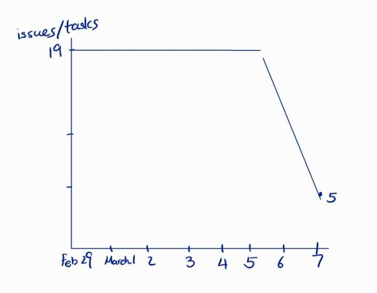
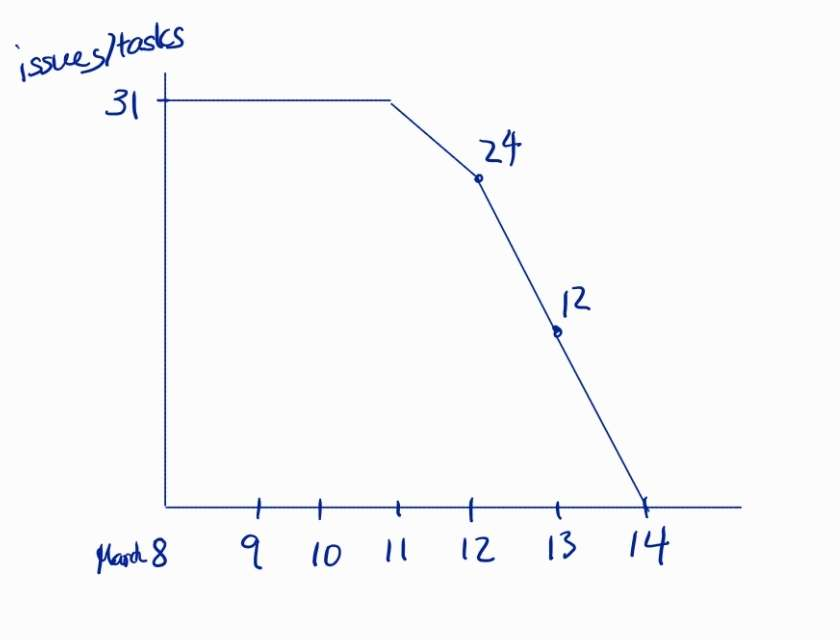

# Team 25 - Successorator 

# MS2 Velocity!

Milestone 2 iteration 1:

We choose an iteration length of 1 week with justification that it allows for 2 iterations per 2 week milestone.

The total amount of time for Milestone 2 is 81 hrs based on our story estimates uncovered after planning poker.=

We assign 40-41 hrs of work for each iteration

Based on our previous iteration and velocity of .78 from MS1 iteration 2.

With 6 people our team capacity per week is:

(work hours per person) * people * velocity = 12 * 6 * .65=46.8.

Thus for iteration 1 we do as many high priority tasks as possible and then fill with medium priority tasks.

In particular we do:

US1 (High priority) US2 (High priority) US4 (Medium Priority) US7 (Medium Priority)

Justification:

We take all the high-priority tasks and two medium-priority tasks, which the rest of the User stories depend on. Also, we will finish implementing all the recurring tasks functionality for client demonstration.

The total amount of time this takes is 20+8+5+8 = 41

 

After iteration 1, US7, US1T6 is rolled over to the next iteration.

Velocity = Finished Task Hour/Estimated Time Spent*Number of Person=25/8*6=0.52

STORIES FOR ITERATION 2:

US3 (Medium Priority) US5 (Medium Priority) US8 (Medium Priority) US6 (Low Priority) US9 (Low Priority)

These sum up to 40 hours and with rolled over tasks: 51hours, with the velocity from the first iteration, we should spend 98 hours.
Velocity = Finished Task Hour/Estimated Time Spent*Number of Person=51/13*6=0.653
 
